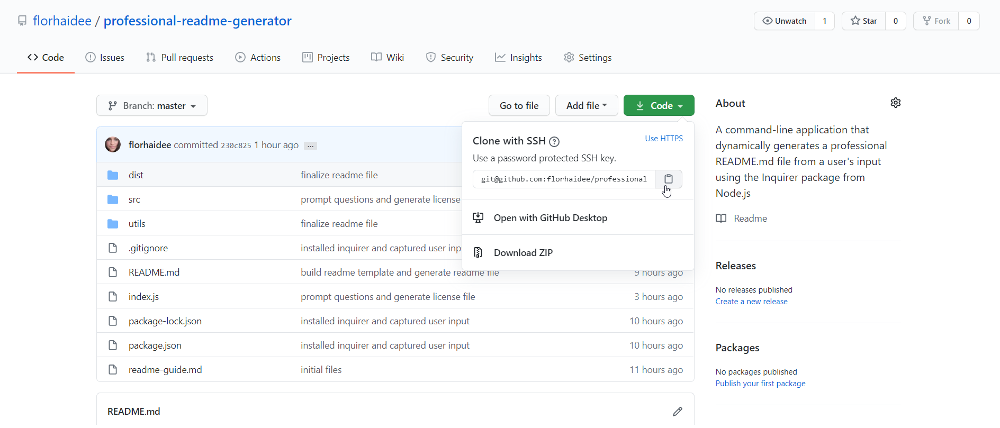

# Professional README Generator Starter Code

[How to create a Professional README](./readme-guide.md)

# Professional README Generator              [](code_of_conduct.md)
  ## Description
    A command-line application that dynamically generates a professional README.md file from a user's input using the Inquirer package from Node.js. 
    Making easy for a developer to generate a professional readme just by typing the information requested thru the command line.


  ## Table of Contents 
  * [Installation](#installation)
  * [Usage](#usage)
  * [License](#license)
  * [Contributing](#contributing)
  * [Questions](#questions)
  
  ## Installation
    1. Download or clone this repository on your computer.
    
    2. Install node.js to do that go to https://nodejs.org/es/download/
    3. Type the following command into your terminal, once you've navigated to the root directory of the project
    ```
    npm init
    ```
    4. After that need to install all the dependencies using npm
    ```
    npm install
    ```


  ## Usage
    To know how to use this application [](https://drive.google.com/file/d/1Z0IC5ZOdM1bY6V4k0pam-U616on1qcz6/view)


  ## License
    Copyright © 2020 florhaidee. 
    Licensed under the MIT to see more about this license you can find it on the file 'license.txt' go to  

  ## Contributing 
    Please note that this project is released with a Contributor Code of Conduct. By participating in this project you agree to abide by its terms.
    Visit  to have more information.
  

  ## Questions
    If you have more questions about this application, you can contact me by:
      email: florhaideeg@gmail.com
      GitHub username: florhaidee

  ## Made with ❤️ by florhaidee
  ## ©️2020 

